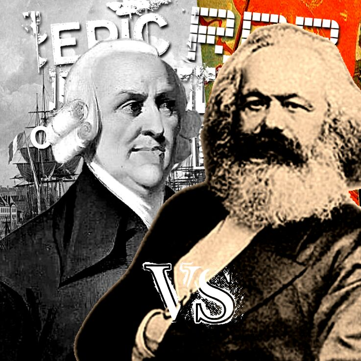

# Applied Data Science @ Columbia
## Spring 2022
## Project 1: A "data story" on the history of philosophy



### [Project Description](doc/)
This is the first and only *individual* (as opposed to *team*) project this semester. 

Term: Spring 2022

+ Projec title: **The Cold War**
+ This project is conducted by **Varchasvi Vedula**

+ Project summary: What ideological differences really drove the Cold War? This report is an analysis of Communist and Capitalist philosophical texts. Using the power of Natural Language Processing, we try to understand the vernacular of these schools of thought, what topics they primarily discuss, and how they relate to certain terms related to socioeconomics, property, finance, and assets, among other themes. We use the techniques of word frequency analysis, Latent Dirichlet Allocation, and word2vec modeling for finding similar words.

To view this project: Go to [this file](./doc/The_Cold_War.html). You may have to hit Download and Save As a .html file locally to view.

To reproduce this project:

1. Download the [dataset](https://www.kaggle.com/kouroshalizadeh/history-of-philosophy) to the [data](./data) folder. 

2. Run the [RMarkdown Notebook](./doc/The_Cold_War.Rmd)

+ For faster runtime, knit the .Rmd file as is.
+ To create all objects from scratch, remove all instances of `eval=F`. Warning: Runtime will be large.

Following [suggestions](http://nicercode.github.io/blog/2013-04-05-projects/) by [RICH FITZJOHN](http://nicercode.github.io/about/#Team) (@richfitz). This folder is orgarnized as follows.

```
proj/
├── lib/
├── data/
├── doc/
├── figs/
└── output/
```

Please see each subfolder for a README file.

Please see [here](./doc/references.md) for all references used.